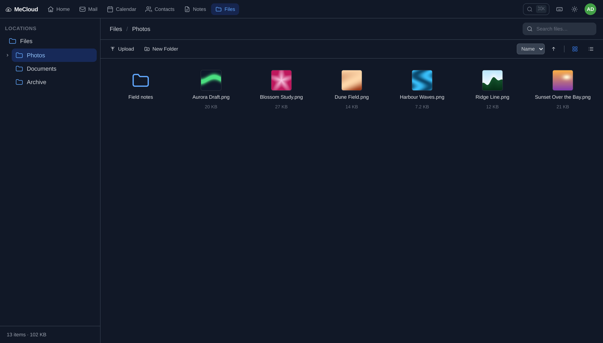
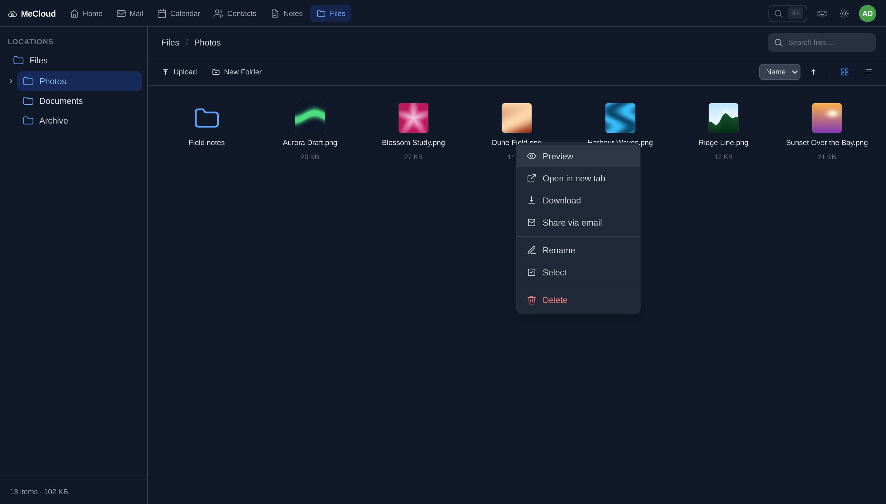
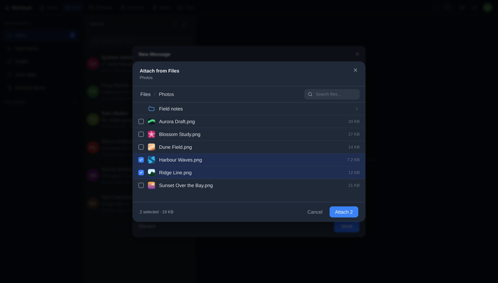
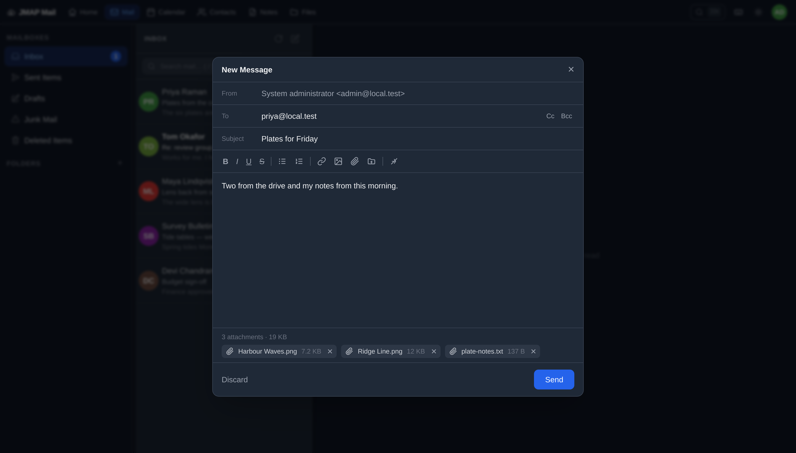
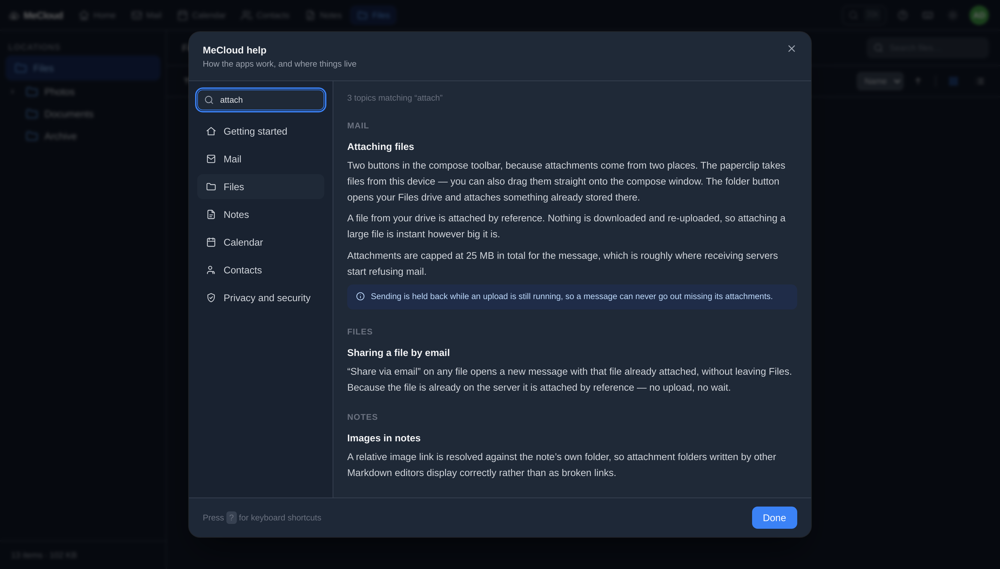
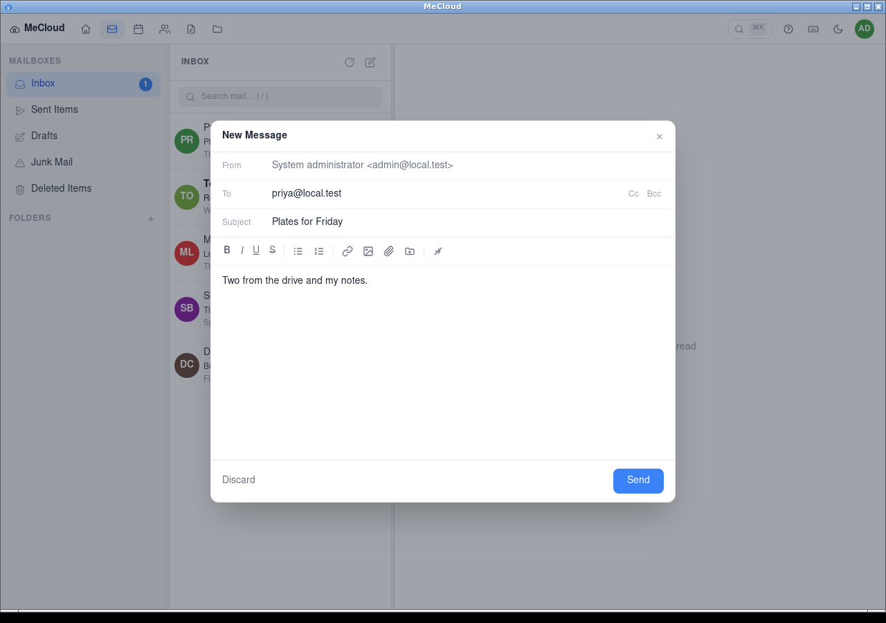
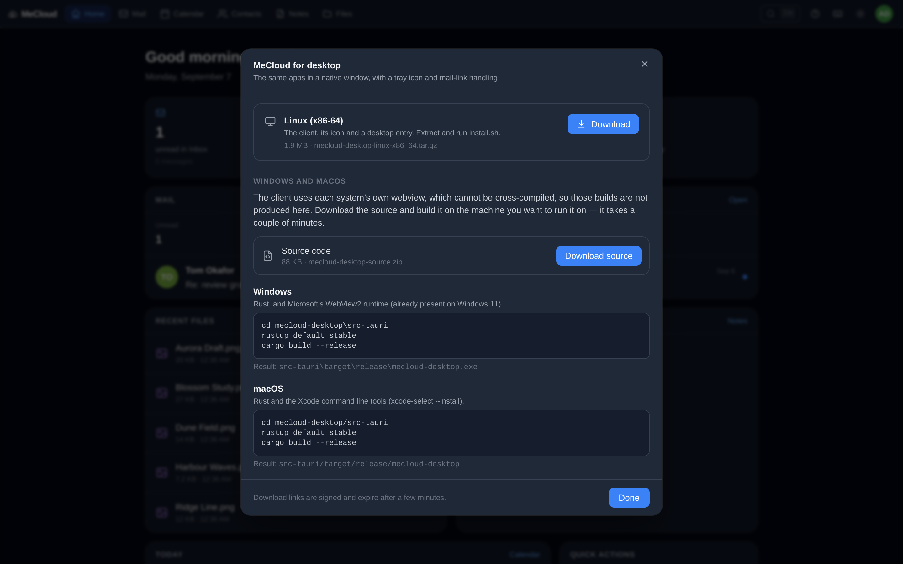

# MeCloud

A clean, minimal personal cloud built on [JMAP](https://jmap.io/) (RFC 8620),
designed for [Stalwart Mail Server](https://stalw.art/): mail, calendar,
contacts, notes and files in one app, sharing one session and one account.
Inspired by iCloud's three-pane layout, with full dark mode support.


*Files — images preview in place of their icon, in both grid and list views:*



*Right-click any item for the common actions, including sharing it by email:*



*…which opens compose with the file already attached. The same picker is
reachable the other way round, from inside compose:*



*Either route, plus the ordinary file picker, on one message — a drive file is
attached by blob reference, so nothing is downloaded or re-uploaded:*



*The **?** in the top bar opens the documentation, searchable across every app:*




*And a desktop client — the same web UI in a native window, with a tray icon and
`mailto:` handling. A link clicked anywhere on the desktop opens compose:*



*It is served by the app itself. Linux is a direct download; Windows and macOS
are built from the source archive, because each uses its own system webview:*



## Features

- **Dashboard** at `/` — unread count, storage used, contacts, today's agenda
  and quick actions, gathered in a single batched JMAP request
- JMAP protocol for fast, efficient mail access (RFC 8620 / RFC 8621) — Mail
  lives at `/mail`
- **Calendar** — month view, create / edit / delete events, per-calendar filtering (JMAP Calendars / RFC 8984)
- **Contacts** — address book list, contact search, create / edit / delete (JMAP Contacts / RFC 9553)
- **Notes** — Markdown notes stored as `.md` files in a `Notes` folder in file
  storage, so an existing folder of Markdown works untouched and the same
  documents stay reachable over WebDAV or any sync tool. Live preview, split
  view, a formatting toolbar (headings, bold, italic, lists, quotes, links,
  code), autosave, full-text search, and front-matter aware titles. Relative
  image links are resolved against the note's own folder, so wiki-style
  attachment paths (`.attachments.NNN/image%20(4).png`) render
- **Files** — an iCloud Drive–style browser over JMAP File Storage: folder tree, breadcrumbs, grid/list views, drag-and-drop upload with progress, drag-to-move, rename, search, and inline preview for images, PDFs, text, audio and video. Images thumbnail in place of their icon in both views, and a right-click menu carries the per-item actions — open, download, rename, delete, and share via email
- Mail attachments — downloadable through the same authenticated blob proxy, and
  sendable from either source: **from this device**, by picker or by dropping onto
  the compose window, with per-file upload progress; or **from Files**, browsing
  the drive in a picker inside compose (or starting from the file's own
  right-click menu). A file already in the drive is attached by blob reference —
  nothing is downloaded or re-uploaded however large it is
- OAuth2 authentication via Stalwart's built-in OAuth2 server
- Three-pane layout: mailboxes / message list / reading pane — collapsing to a
  single pane with drill-down navigation and an off-canvas sidebar below 1024px
- Mailbox and Folders sections — system mailboxes (Inbox, Sent, Drafts…) separated from user folders
- App switcher — tabs in the top bar on desktop, a sheet menu on mobile
- Dark mode (system preference + manual toggle, persisted)
- Real-time push via JMAP EventSource (SSE), with an exponential-backoff reconnect and a polling fallback
- **Remote images blocked by default** — tracking pixels do not load until you ask, per message or per sender
- **Mail filters** — a rule builder (From/To/Cc/Subject conditions, file-into /
  mark / discard actions) compiled to a Sieve script, so rules run server-side
  and apply to mail arriving from any client
- **App passwords** — create and revoke app-specific passwords for IMAP/SMTP
  clients, with the secret shown exactly once
- **vCard import** — drop a `.vcf` file onto Contacts to bulk-import an address
  book
- **Desktop client** (Linux, [`desktop/`](desktop/)) — a Tauri shell hosting the
  same web UI in a native window: tray icon, stays resident when closed, and
  registers as the system `mailto:` handler so mail links from any app open a
  pre-filled compose window. 4.6 MB, because the window is the OS's own webview.
  File sync is not implemented yet
- **The client ships with the server** — the Linux binary and a source archive
  are built into the Docker image and offered under *Get the desktop app*.
  Downloads are gated: the session buys a signed link that expires in five
  minutes, so nothing is served unauthenticated and the transfer still works
  outside the app
- **In-app documentation** — the **?** in the top bar opens a searchable help
  modal covering all six apps plus privacy and security, available from every
  page and from the command palette
- **Command palette** (`Ctrl`/`Cmd` + `K`) — fuzzy jump to any app, mailbox, contact, calendar or file, plus commands like compose and toggle theme
- **Keyboard shortcuts** — `j`/`k` to move, `r`/`a`/`f` to reply, `c` to compose, `?` for the full list
- Correct reply threading (`In-Reply-To` / `References`), Cc and Bcc
- Loading indicators throughout — a global activity bar, skeleton lists, and a spinner on every action that talks to the server
- Installable as a PWA — web manifest, generated icons and a service worker that
  precaches the built assets
- Single Docker image — FastAPI serves both the API and the compiled frontend

## Stack

| Layer | Technology |
|---|---|
| Backend | Python 3.13, FastAPI, Starlette, httpx |
| Frontend | SvelteKit 2, Svelte 5, Vite 8, Tailwind CSS |
| Sanitisation | DOMPurify, plus a script-less sandboxed iframe |
| Auth | OAuth2 authorization code flow with PKCE (S256) |
| Session | Encrypted cookie (Fernet: AES-CBC + HMAC-SHA256) |
| Markdown | marked (GFM), sanitised through DOMPurify |
| Protocol | JMAP (RFC 8620, RFC 8621, RFC 8984, RFC 9553, draft-ietf-jmap-filenode) |
| Tested against | Stalwart 0.16 (JMAP core, mail, submission, calendars, contacts, filenode, sieve) |
| Runtime | Single Docker image (multi-stage build) |

## Quick Start

### Prerequisites

- Docker and Docker Compose
- A running [Stalwart Mail Server](https://stalw.art/) instance with an OAuth2 client configured

### 1. Configure OAuth2 in Stalwart

In the Stalwart admin panel, create an OAuth2 client with:
- **Redirect URI:** `http://localhost:8000/auth/callback` (or your public URL)
- **Grant type:** Authorization Code
- Note the **Client ID** and **Client Secret**

### 2. Configure the application

```bash
cp .env.example .env
```

Edit `.env`:

```env
STALWART_URL=https://mail.example.com
OAUTH_CLIENT_ID=jmap-webclient
OAUTH_CLIENT_SECRET=your-client-secret
OAUTH_REDIRECT_URI=http://localhost:8000/auth/callback
SESSION_SECRET=<output of: python3 -c "import secrets; print(secrets.token_hex(32))">
```

### 3. Run

```bash
docker compose up --build
```

Open `http://localhost:8000` — you will be redirected to Stalwart's OAuth login page.

## Development

Run the backend and frontend separately for a faster dev loop:

**Backend:**
```bash
cd backend
python -m venv .venv && source .venv/bin/activate
pip install -r requirements.txt
uvicorn app.main:app --reload --port 8000
```

**Frontend** (in a separate terminal):
```bash
cd frontend
npm install
npm run dev
```

The Vite dev server proxies `/api` and `/auth` to `http://localhost:8000`, so both run together at `http://localhost:5173`.

## Docker

The image uses a true multi-stage build:

1. **`frontend-builder`** (Node 24) — runs `npm run build`, producing a static SvelteKit output
2. **`desktop-builder`** (Rust 1, trixie) — builds the Linux desktop client and
   packages it, plus a source archive for Windows and macOS, into `/out`
3. **`python-deps`** (Python 3.13-slim) — installs Python packages into a prefix directory
4. **Final stage** (Python 3.13-slim) — copies packages, built frontend and desktop
   artefacts, runs as a non-root user

The Rust stage is by far the slowest, and only depends on `desktop/`, so it
caches independently of the web app. Skip it while iterating:

```bash
docker build --build-arg WITH_DESKTOP=0 -t mecloud .
```

The image is still valid without it — the download screen reports that this
build shipped nothing to download.

```bash
# Build manually
docker build -t mecloud .

# Run
docker run -p 8000:8000 --env-file .env mecloud
```

## CI/CD (GitLab)

The included `.gitlab-ci.yml` pipeline:

| Stage | Job | What it does |
|---|---|---|
| `build` | `build-image` | Builds and pushes `:sha` + `:branch` tags to the GitLab registry |
| `test` | `backend-tests` | `pytest` |
| `test` | `frontend-tests` | `npm ci`, `svelte-check`, `vitest` |
| `test` | `dependency-audit` | CVE scan of both manifests via the internal registry |
| `test` | `smoke-test` | Starts the container and asserts `/health` returns `{"status":"ok"}` |
| `release` | `tag-latest` | Promotes `:sha` to `:latest` — only on `main` |

Uses GitLab's built-in container registry (`$CI_REGISTRY_IMAGE`), and pulls all
public base images through the group Dependency Proxy. No additional variables
are needed beyond the defaults GitLab injects, with one optional exception.

### Enabling the dependency audit

`dependency-audit` runs `minireg audit --fail-on high` against
`backend/requirements.txt` and `frontend/package-lock.json`, failing the
pipeline on a high or critical CVE and blocking promotion to `:latest`.

It is **off unless explicitly enabled.** Two CI/CD variables are needed under
*Settings → CI/CD → Variables*:

| Variable | Value | Notes |
|---|---|---|
| `MINIREG_ENABLED` | `true` | The opt-in switch — the job is skipped for any other value, including unset |
| `MINIREG_URL` | registry base URL | e.g. `https://registry.example.internal` |
| `MINIREG_TOKEN` | a read token | Mask it; `read` scope is sufficient |
| `MINIREG_HOST_IP` | registry IP | Optional — only if CI runners cannot resolve the hostname |

None of these are committed. The pipeline reads them from project settings so
that this repository discloses no internal hostnames or addresses.

An explicit flag rather than inferring from the token's presence: whether a
security gate is running should be a stated decision, not a side effect of which
secrets happen to exist. If `MINIREG_ENABLED` is `true` but the token is
missing, the job fails immediately and says so, rather than dying later with an
opaque *not logged in*.

To run the same scan locally:

```bash
curl -fsSL "$MINIREG_URL/api/cli/install.sh" | sh
minireg login --url "$MINIREG_URL"
minireg audit backend
minireg audit frontend
```

## Project Structure

```
mecloud/
├── backend/
│   ├── app/
│   │   ├── main.py       # FastAPI app, security middleware, routes, static serving
│   │   ├── blobs.py      # Authenticated blob upload/download proxy
│   │   ├── auth.py       # OAuth2 authorization code flow (PKCE)
│   │   ├── jmap.py       # JMAP session cache, request proxy, SSE stream
│   │   ├── http.py       # Pooled upstream httpx clients + error mapping
│   │   ├── session.py    # Encrypted session cookie middleware
│   │   ├── models.py     # Request envelope validation
│   │   └── config.py     # Settings (pydantic-settings)
│   └── tests/            # pytest: api, blobs, jmap, session
├── frontend/
│   ├── scripts/gen-icons.mjs       # PWA + Apple touch icons, generated at build
│   └── src/
│       ├── service-worker.js       # Precaches the built assets
│       ├── lib/
│       │   ├── api.js              # JMAP helpers (mail, calendar, contacts, sieve)
│       │   ├── sanitize.js         # DOMPurify config + remote-content blocking
│       │   ├── urls.js             # Remote-URL classification (pure, unit-tested)
│       │   ├── dashboard.js        # Batched overview query + summarising
│       │   ├── files.js            # JMAP FileNode calls + blob transfer
│       │   ├── fileTypes.js        # File classification (pure, unit-tested)
│       │   ├── attachments.js      # Attachment selection rules (pure, unit-tested)
│       │   ├── notes.js            # Notes over FileNode (.md in a Notes folder)
│       │   ├── markdown.js         # Markdown render + sanitise
│       │   ├── markdownEdit.js     # Toolbar text transforms (pure, unit-tested)
│       │   ├── jmapErrors.js       # RFC 8620 error mapping (pure, unit-tested)
│       │   ├── layout.js           # Pane sizing (pure, unit-tested)
│       │   ├── fuzzy.js            # Palette ranking (pure, unit-tested)
│       │   ├── help.js             # In-app documentation + search (pure, unit-tested)
│       │   ├── vcardParser.js      # vCard import parsing
│       │   ├── mailboxRefresh.js   # Shared mailbox counter refresh
│       │   ├── trustedSenders.js   # "Always show images from…" list
│       │   ├── apps.js             # The app list, shared by tabs + palette
│       │   ├── stores/
│       │   │   ├── mail.js         # Mail state (mailboxes, emails, session)
│       │   │   ├── files.js        # Files state (nodes, selection, preview, menu)
│       │   │   ├── notes.js        # Notes state
│       │   │   ├── calendar.js     # Calendar state (events, view, selection)
│       │   │   ├── contacts.js     # Contacts state (address books, search)
│       │   │   ├── activity.js     # In-flight request counter → progress bar
│       │   │   ├── viewport.js     # Compact-layout + sidebar drawer state
│       │   │   └── toast.js        # Transient notifications
│       │   └── components/
│       │       ├── Modal.svelte             # Accessible dialog shell (focus trap, Esc)
│       │       ├── ComposeModal.svelte      # Compose, rich text, attachments
│       │       ├── MessageList.svelte       # Message list, multi-select, drag
│       │       ├── MessagePane.svelte       # Reading pane, sandboxed body iframe
│       │       ├── ContextMenu.svelte       # Right-click menu for messages
│       │       ├── FileContextMenu.svelte   # Right-click menu for files
│       │       ├── FilePicker.svelte        # Browse the drive to attach files
│       │       ├── FileThumbnail.svelte     # Image preview, icon fallback
│       │       ├── FilePreview.svelte       # Preview / edit a stored file
│       │       ├── FileIcon.svelte          # Per-kind icon + accent
│       │       ├── FolderTree.svelte        # Recursive folder tree
│       │       ├── SieveEditor.svelte       # Mail filter rule builder → Sieve
│       │       ├── AppPasswordsModal.svelte # App-specific passwords
│       │       ├── ContactImportModal.svelte# vCard import
│       │       ├── HelpModal.svelte         # Searchable in-app documentation
│       │       ├── ShortcutsHelp.svelte     # Keyboard shortcut reference
│       │       ├── CommandPalette.svelte    # Ctrl/Cmd+K launcher
│       │       ├── AppTabs.svelte           # Top-bar app switcher
│       │       ├── AppMenu.svelte           # Mobile app sheet
│       │       ├── CalendarGrid.svelte      # Month-view calendar grid
│       │       ├── EventModal.svelte        # Create / edit calendar event
│       │       ├── ContactModal.svelte      # Create / edit contact
│       │       └── ...                     # Sidebar, Navbar, Toasts, Spinner, …
│       ├── routes/
│       │   ├── +layout.svelte              # Auth guard, dark mode, activity bar, tab badge
│       │   ├── +page.svelte                # Dashboard
│       │   ├── mail/+page.svelte           # Mail three-pane view, realtime, shortcuts
│       │   ├── calendar/+page.svelte       # Calendar view
│       │   ├── contacts/+page.svelte       # Contacts view
│       │   ├── files/+page.svelte          # Files (Drive) view
│       │   └── notes/+page.svelte          # Notes (Markdown) view
│       └── tests/                          # vitest, pure-module unit tests
├── desktop/                        # Tauri desktop client (Linux) — see desktop/README.md
│   ├── src-tauri/src/
│   │   ├── lib.rs                  # windows, tray, commands
│   │   ├── config.rs               # server address (pure, unit-tested)
│   │   ├── deeplink.rs             # mailto: → compose URL (pure, unit-tested)
│   │   └── handlers.rs             # .desktop entry + xdg-mime (unit-tested)
│   └── ui/index.html               # local setup page
├── Dockerfile
├── docker-compose.yml
├── .env.example
└── .gitlab-ci.yml
```

## Security Notes

**Tokens and sessions**

- OAuth access and refresh tokens never reach the browser as usable credentials. They live in an **encrypted** session cookie — Fernet (AES-128-CBC + HMAC-SHA256), keyed by HKDF from `SESSION_SECRET`. Starlette's stock session middleware only *signs* the cookie, which leaves the payload readable as plain base64; that is why this app ships its own middleware in [`backend/app/session.py`](backend/app/session.py).
- The cookie is `HttpOnly`, `SameSite=Lax`, and in production `Secure` with the `__Host-` prefix, which pins it to the exact origin.
- `SESSION_SECRET` must be at least 32 characters in production — the app refuses to start otherwise. Rotating it invalidates every outstanding session.
- The session is rotated on login, so a pre-login cookie cannot be upgraded into an authenticated one.
- OAuth state is compared in constant time, the PKCE verifier is single-use, and discovered OAuth endpoints must be same-origin with `STALWART_URL`.
- Logout is `POST`-only; a `GET` logout can be fired cross-site by an `` tag.

**Rendering untrusted mail**

- Message bodies render inside an iframe whose `sandbox` omits `allow-scripts` and `allow-same-origin`. Script in an email cannot execute and cannot reach this origin — that is the actual boundary, not the sanitiser.
- DOMPurify runs as defence in depth, and rewrites every link to `target="_blank" rel="noopener noreferrer nofollow"`.
- Remote images, `srcset`, `poster`, `background`, and remote `url()` in inline CSS are stripped by default and restored only when the user clicks **Show images** (or trusts the sender). A remote image in an email is a read receipt the sender never asked permission for.

**Rendering notes**

Notes are the one place message- or file-derived markup renders in the *parent*
document rather than a sandboxed iframe, so the sanitiser is the only boundary
rather than defence in depth. Every render path goes through it — there is no
"trusted" note, since a `.md` file can arrive from any sync tool with write
access to the account. Script tags, inline event handlers, `javascript:` URLs,
iframes, objects and form controls are all removed, and surviving links get
`target="_blank" rel="noopener noreferrer nofollow"`. GFM task lists are
rendered as styled spans rather than real checkboxes, so no form control has to
be allowed through for them.

**Serving stored files**

Blob bytes are proxied by the backend rather than fetched directly, because the
bearer token lives in the encrypted session and never reaches the browser. That
makes this app the origin serving user-supplied content, which is the sharp edge:
a stored HTML or SVG file rendered inline would execute as **first-party** script
with access to everything on the origin. Three independent defences apply:

- an allow-list of media types that may render inline — anything script-capable
  (`text/html`, `image/svg+xml`, `application/xhtml+xml`, …) is not on it and is
  forced to `application/octet-stream`;
- `Content-Disposition: attachment` for everything outside that allow-list, with
  an RFC 6266 `filename*` so a hostile filename cannot inject headers;
- a per-response `Content-Security-Policy: sandbox; default-src 'none'`, which
  strips script and same-origin privileges even if the first two were wrong.

Blob ids are validated against a conservative character class and percent-encoded
before interpolation, so they cannot add path segments or query parameters to the
upstream download URL. Uploads have their own 64 MiB ceiling
(`MAX_UPLOAD_BYTES`) kept deliberately separate from the 1 MiB JMAP body cap —
raising one limit for everything would have thrown away the protection the tight
cap provides.

**Embedding**

Framing is denied outright by default (`X-Frame-Options: DENY` plus
`frame-ancestors 'none'`) — a mail client that can be framed can be overlaid and
click-jacked, and this one has destructive controls and shows private mail. To
embed it in a dashboard you control, set `FRAME_ANCESTORS` to that exact origin;
never a wildcard. Doing so also drops `X-Frame-Options`, which cannot express an
allow-list and would otherwise keep blocking the frame regardless of the CSP.

**Transport and abuse**

- CSP, HSTS, `frame-ancestors 'none'`, `X-Content-Type-Options`, COOP/CORP on every response; `no-store` on everything under `/api` and `/auth`.
- Host header allow-list derived from `APP_URL`, per-IP rate limits on every route, and a 1 MiB request body cap enforced against both the declared `Content-Length` and the bytes actually received.
- All upstream calls run through a pooled `httpx` client with explicit connect/read timeouts, and concurrent SSE streams are capped.
- An upstream `401` maps to a `401` (log back in) rather than a `502`, so a revoked token no longer traps the client in a retry loop.

**Known residual risk**

- `script-src` still includes `'unsafe-inline'`, which SvelteKit's hydration bootstrap requires. Because email content cannot execute script at all (see above), this is not the app's XSS boundary. To remove it, enable `csp: { mode: 'hash' }` in `svelte.config.js` and verify the build still hydrates.

## Testing

```bash
# Desktop client (Rust, in its build container — see desktop/README.md)
cd desktop && docker run --rm -e CARGO_HOME=/cargo -v "$PWD":/src \
  -v "$PWD/.cargo-cache":/cargo -w /src/src-tauri mecloud-rust:trixie cargo test

# Backend
cd backend && pip install -r requirements-dev.txt && pytest

# Frontend
cd frontend && npm install && npm test        # 299 unit tests
cd frontend && npm run check                  # svelte-check
```

The frontend tests deliberately cover the *pure* modules — file classification,
Markdown rendering and editing, URL classification, JMAP error mapping, palette
ranking, layout maths, upload retry/backoff, attachment selection, help search,
the dashboard summary — rather than
rendering components. Anything with a decision worth getting wrong is factored
out of the `.svelte` file so it can be tested directly.

## Upgrading dependencies

Both the Docker build and CI use `npm ci`, which installs the committed
lockfile exactly and fails if it has drifted from `package.json`. So after
changing `frontend/package.json`, run `npm install` in `frontend/` and commit
the regenerated `package-lock.json` in the same change — otherwise the build
stops, by design.

## AI Disclosure

This project was scaffolded with the assistance of [Claude](https://claude.ai/) (Anthropic). The architecture, code structure, and implementation were generated through a human-directed conversation and reviewed by the project author. All code should be audited before use in a production environment.

## License

MIT — see [LICENSE](LICENSE).
