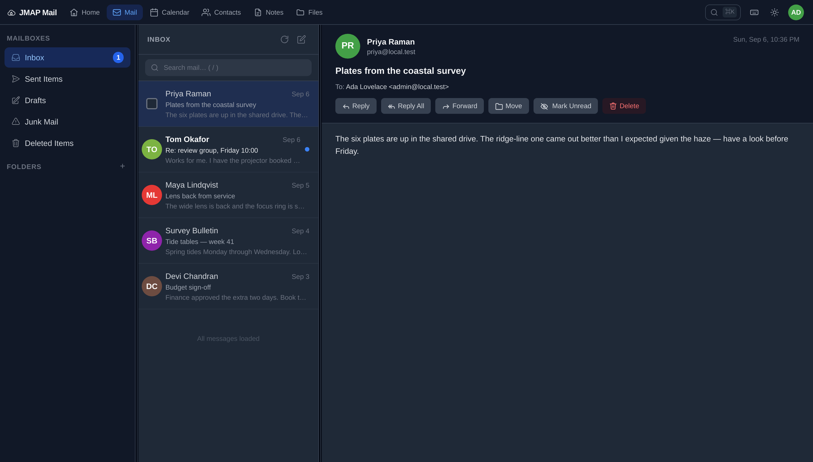
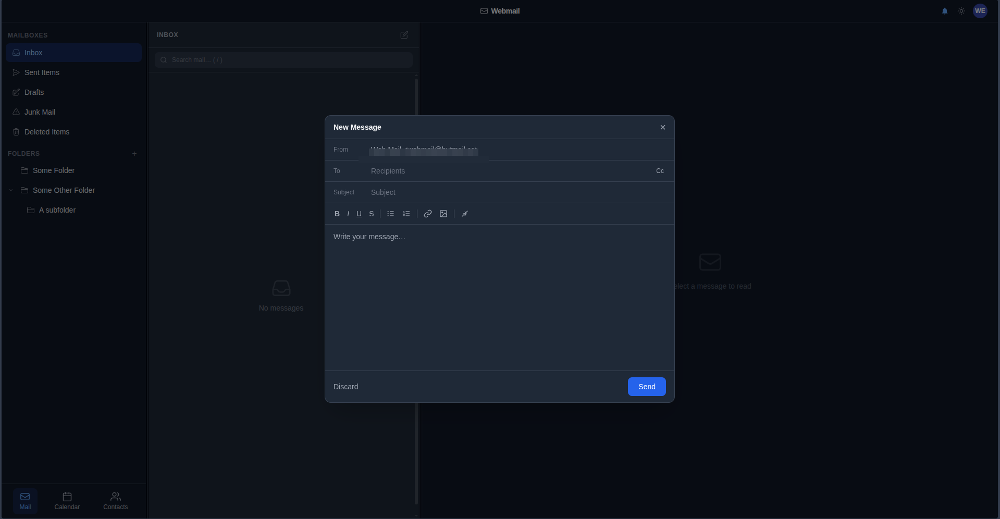
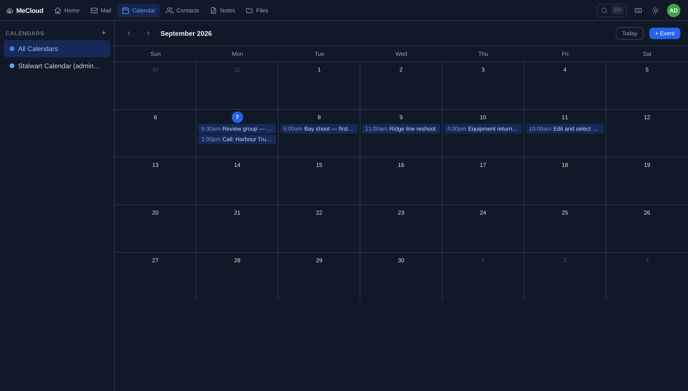
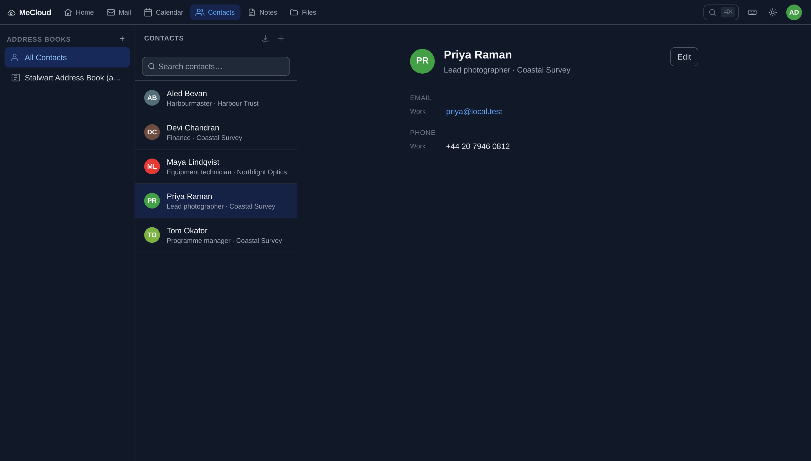

# JMAP Mail

A clean, minimal webmail client built on [JMAP](https://jmap.io/) (RFC 8620), designed for [Stalwart Mail Server](https://stalw.art/). Inspired by iCloud Mail's three-pane layout with full dark mode support.









## Features

- JMAP protocol for fast, efficient mail access (RFC 8620 / RFC 8621)
- **Calendar** — month view, create / edit / delete events, per-calendar filtering (JMAP Calendars / RFC 8984)
- **Contacts** — address book list, contact search, create / edit / delete (JMAP Contacts / RFC 9553)
- OAuth2 authentication via Stalwart's built-in OAuth2 server
- Three-pane layout: mailboxes / message list / reading pane
- Mailbox and Folders sections — system mailboxes (Inbox, Sent, Drafts…) separated from user folders
- App switcher (bottom of the sidebar) to switch between Mail, Calendar, and Contacts
- Dark mode (system preference + manual toggle, persisted)
- Real-time push via JMAP EventSource (SSE), with an exponential-backoff reconnect and a polling fallback
- **Remote images blocked by default** — tracking pixels do not load until you ask, per message or per sender
- **Keyboard shortcuts** — `j`/`k` to move, `r`/`a`/`f` to reply, `c` to compose, `?` for the full list
- Correct reply threading (`In-Reply-To` / `References`), Cc and Bcc
- Loading indicators throughout — a global activity bar, skeleton lists, and a spinner on every action that talks to the server
- Single Docker image — FastAPI serves both the API and the compiled frontend

## Stack

| Layer | Technology |
|---|---|
| Backend | Python 3.13, FastAPI, Starlette, httpx |
| Frontend | SvelteKit 2, Svelte 5, Vite 8, Tailwind CSS |
| Sanitisation | DOMPurify, plus a script-less sandboxed iframe |
| Auth | OAuth2 authorization code flow with PKCE (S256) |
| Session | Encrypted cookie (Fernet: AES-CBC + HMAC-SHA256) |
| Protocol | JMAP (RFC 8620, RFC 8621, RFC 8984, RFC 9553) |
| Runtime | Single Docker image (multi-stage build) |

## Quick Start

### Prerequisites

- Docker and Docker Compose
- A running [Stalwart Mail Server](https://stalw.art/) instance with an OAuth2 client configured

### 1. Configure OAuth2 in Stalwart

In the Stalwart admin panel, create an OAuth2 client with:
- **Redirect URI:** `http://localhost:8000/auth/callback` (or your public URL)
- **Grant type:** Authorization Code
- Note the **Client ID** and **Client Secret**

### 2. Configure the application

```bash
cp .env.example .env
```

Edit `.env`:

```env
STALWART_URL=https://mail.example.com
OAUTH_CLIENT_ID=jmap-webclient
OAUTH_CLIENT_SECRET=your-client-secret
OAUTH_REDIRECT_URI=http://localhost:8000/auth/callback
SESSION_SECRET=<output of: python3 -c "import secrets; print(secrets.token_hex(32))">
```

### 3. Run

```bash
docker compose up --build
```

Open `http://localhost:8000` — you will be redirected to Stalwart's OAuth login page.

## Development

Run the backend and frontend separately for a faster dev loop:

**Backend:**
```bash
cd backend
python -m venv .venv && source .venv/bin/activate
pip install -r requirements.txt
uvicorn app.main:app --reload --port 8000
```

**Frontend** (in a separate terminal):
```bash
cd frontend
npm install
npm run dev
```

The Vite dev server proxies `/api` and `/auth` to `http://localhost:8000`, so both run together at `http://localhost:5173`.

## Docker

The image uses a true multi-stage build:

1. **`frontend-builder`** (Node 24) — runs `npm run build`, producing a static SvelteKit output
2. **`python-deps`** (Python 3.13-slim) — installs Python packages into a prefix directory
3. **Final stage** (Python 3.13-slim) — copies packages and built frontend, runs as a non-root user

```bash
# Build manually
docker build -t jmap-mail .

# Run
docker run -p 8000:8000 --env-file .env jmap-mail
```

## CI/CD (GitLab)

The included `.gitlab-ci.yml` pipeline:

| Stage | Job | What it does |
|---|---|---|
| `build` | `build-image` | Builds and pushes `:sha` + `:branch` tags to the GitLab registry |
| `test` | `smoke-test` | Starts the container and asserts `/health` returns `{"status":"ok"}` |
| `release` | `tag-latest` | Promotes `:sha` to `:latest` — only on `main` |

Uses GitLab's built-in container registry (`$CI_REGISTRY_IMAGE`). No additional variables needed beyond the defaults GitLab injects.

## Project Structure

```
jmap-mail/
├── backend/
│   └── app/
│       ├── main.py       # FastAPI app, security middleware, routes, static serving
│       ├── auth.py       # OAuth2 authorization code flow (PKCE)
│       ├── jmap.py       # JMAP session cache, request proxy, SSE stream
│       ├── http.py       # Pooled upstream httpx clients + error mapping
│       ├── session.py    # Encrypted session cookie middleware
│       ├── models.py     # Request envelope validation
│       └── config.py     # Settings (pydantic-settings)
├── frontend/
│   └── src/
│       ├── lib/
│       │   ├── api.js                   # JMAP API helpers (mail, calendar, contacts)
│       │   ├── sanitize.js              # DOMPurify config + remote-content blocking
│       │   ├── urls.js                  # Remote-URL classification (pure, unit-tested)
│       │   ├── trustedSenders.js        # "Always show images from…" list
│       │   ├── stores/
│       │   │   ├── mail.js              # Mail state (mailboxes, emails, session)
│       │   │   ├── activity.js          # In-flight request counter → progress bar
│       │   │   ├── calendar.js          # Calendar state (events, view, selection)
│       │   │   └── contacts.js          # Contacts state (address books, search)
│       │   └── components/
│       │       ├── Modal.svelte          # Accessible dialog shell (focus trap, Esc)
│       │       ├── Spinner.svelte        # Shared loading indicator
│       │       ├── ProgressBar.svelte    # Global activity bar
│       │       ├── ShortcutsHelp.svelte  # Keyboard shortcut reference
│       │       ├── AppNav.svelte         # Bottom app switcher
│       │       ├── CalendarGrid.svelte   # Month-view calendar grid
│       │       ├── EventModal.svelte     # Create / edit calendar event
│       │       ├── ContactModal.svelte   # Create / edit contact
│       │       └── ...                  # Sidebar, MessageList, MessagePane, …
│       └── routes/
│           ├── +layout.svelte            # Auth guard, dark mode, activity bar, tab badge
│           ├── +page.svelte              # Mail three-pane view, realtime, shortcuts
│           ├── calendar/+page.svelte     # Calendar view
│           └── contacts/+page.svelte     # Contacts view
├── Dockerfile
├── docker-compose.yml
├── .env.example
└── .gitlab-ci.yml
```

## Security Notes

**Tokens and sessions**

- OAuth access and refresh tokens never reach the browser as usable credentials. They live in an **encrypted** session cookie — Fernet (AES-128-CBC + HMAC-SHA256), keyed by HKDF from `SESSION_SECRET`. Starlette's stock session middleware only *signs* the cookie, which leaves the payload readable as plain base64; that is why this app ships its own middleware in [`backend/app/session.py`](backend/app/session.py).
- The cookie is `HttpOnly`, `SameSite=Lax`, and in production `Secure` with the `__Host-` prefix, which pins it to the exact origin.
- `SESSION_SECRET` must be at least 32 characters in production — the app refuses to start otherwise. Rotating it invalidates every outstanding session.
- The session is rotated on login, so a pre-login cookie cannot be upgraded into an authenticated one.
- OAuth state is compared in constant time, the PKCE verifier is single-use, and discovered OAuth endpoints must be same-origin with `STALWART_URL`.
- Logout is `POST`-only; a `GET` logout can be fired cross-site by an `` tag.

**Rendering untrusted mail**

- Message bodies render inside an iframe whose `sandbox` omits `allow-scripts` and `allow-same-origin`. Script in an email cannot execute and cannot reach this origin — that is the actual boundary, not the sanitiser.
- DOMPurify runs as defence in depth, and rewrites every link to `target="_blank" rel="noopener noreferrer nofollow"`.
- Remote images, `srcset`, `poster`, `background`, and remote `url()` in inline CSS are stripped by default and restored only when the user clicks **Show images** (or trusts the sender). A remote image in an email is a read receipt the sender never asked permission for.

**Transport and abuse**

- CSP, HSTS, `frame-ancestors 'none'`, `X-Content-Type-Options`, COOP/CORP on every response; `no-store` on everything under `/api` and `/auth`.
- Host header allow-list derived from `APP_URL`, per-IP rate limits on every route, and a 1 MiB request body cap enforced against both the declared `Content-Length` and the bytes actually received.
- All upstream calls run through a pooled `httpx` client with explicit connect/read timeouts, and concurrent SSE streams are capped.
- An upstream `401` maps to a `401` (log back in) rather than a `502`, so a revoked token no longer traps the client in a retry loop.

**Known residual risk**

- `script-src` still includes `'unsafe-inline'`, which SvelteKit's hydration bootstrap requires. Because email content cannot execute script at all (see above), this is not the app's XSS boundary. To remove it, enable `csp: { mode: 'hash' }` in `svelte.config.js` and verify the build still hydrates.

## Testing

```bash
# Backend
cd backend && pip install -r requirements-dev.txt && pytest

# Frontend
cd frontend && npm install && npm test
```

## Upgrading dependencies

Both the Docker build and CI use `npm ci`, which installs the committed
lockfile exactly and fails if it has drifted from `package.json`. So after
changing `frontend/package.json`, run `npm install` in `frontend/` and commit
the regenerated `package-lock.json` in the same change — otherwise the build
stops, by design.

## AI Disclosure

This project was scaffolded with the assistance of [Claude](https://claude.ai/) (Anthropic). The architecture, code structure, and implementation were generated through a human-directed conversation and reviewed by the project author. All code should be audited before use in a production environment.

## License

MIT — see [LICENSE](LICENSE).
