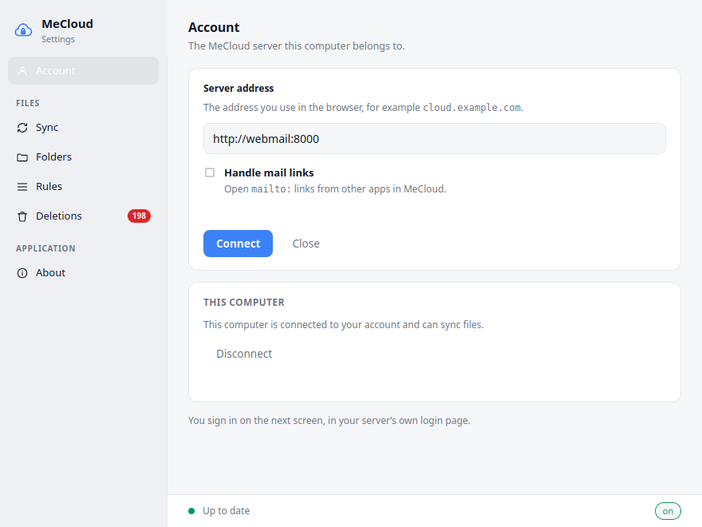
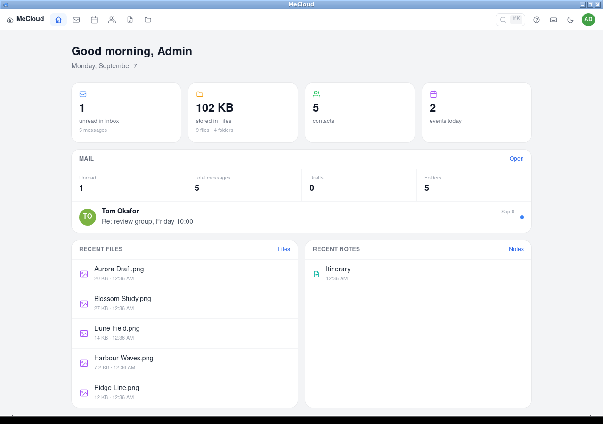
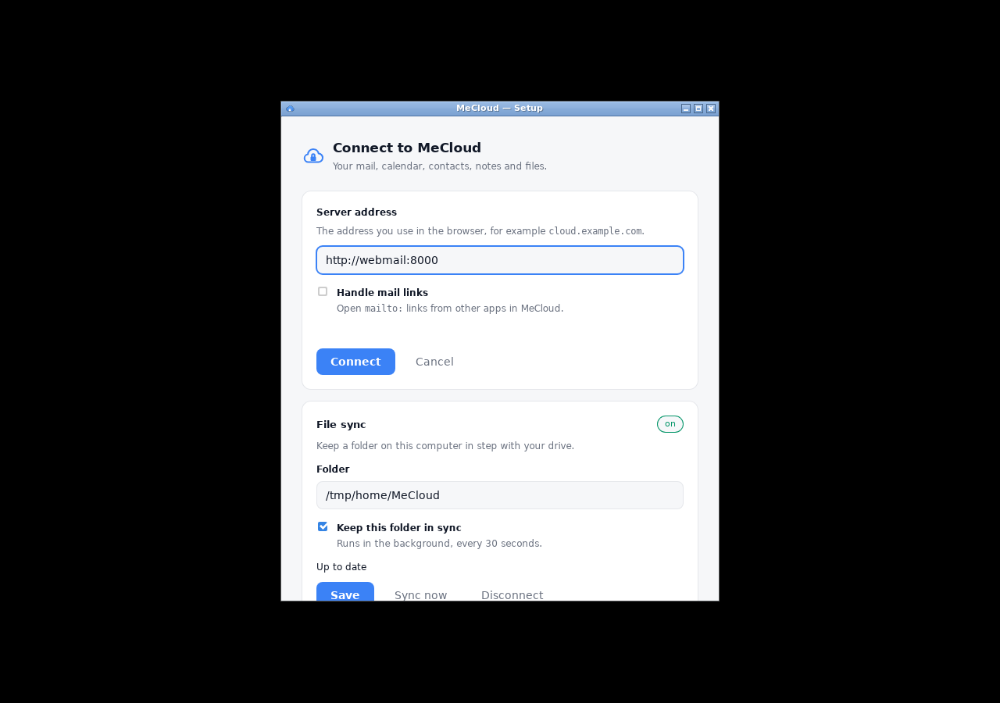

# MeCloud desktop client

The MeCloud web apps in a native window, with the desktop integration a web
page cannot do for itself: a tray icon, staying resident when its window is
closed, and being the system's handler for `mailto:` links.

Built with [Tauri 2](https://tauri.app/) — the window is the operating system's
own webview, so the binary is small (**4.6 MB** stripped, release) and the
embedded UI is the same one you get in a browser rather than a reimplementation
of it.



Connecting to a server, and once connected, the web apps in a native window:



## How it fits together

```
┌─ mecloud-desktop ──────────────────────────────┐
│  tray icon        open / compose / go to / quit│
│  setup window     local page, server address   │
│  main window      the server's web UI, remote  │
│  mailto: handler  .desktop entry + xdg-mime    │
└────────────────────────────────────────────────┘
                     │ https
                     ▼
        MeCloud server (FastAPI + JMAP proxy)
                     │
                     ▼
              Stalwart Mail Server
```

## Authentication

**The client never handles a credential.** The main window loads the server and
signs in through the server's ordinary OAuth2 authorization-code flow with
PKCE — the same flow a browser gets. The resulting tokens stay in the server's
encrypted, `HttpOnly` session cookie, inside the webview's own cookie jar.

This is a deliberate choice over having the client run its own OAuth flow and
store tokens in a keyring. There is no second, weaker login path to attack, no
token at rest on the client, and signing out on the server signs out the client.

The trade is that the *native* side of the client has no credentials of its own,
which the sync engine will need. See *Sync*.

### Why the embedded UI cannot call the client

The main window points at a remote origin. `src-tauri/capabilities/default.json`
scopes every permission to the `setup` window and lists no remote URLs, so
content served over the network has no IPC access — it is a web page, with a web
page's reach. Only the local setup page can call into the client, and its
commands are limited to reading and writing the server address.

## Building

Nothing needs installing on the host: the toolchain is a container.

```bash
docker build -f Dockerfile.build -t mecloud-rust:trixie .

docker run --rm -u "$(id -u):$(id -g)" -e HOME=/tmp -e CARGO_HOME=/cargo \
  -v "$PWD":/src -v /some/cache:/cargo -w /src/src-tauri \
  mecloud-rust:trixie cargo build --release
```

Debian trixie is pinned deliberately: Tauri links against the system WebKitGTK,
and a binary built against a newer one will not start on an older target.

```bash
# Unit tests — URL handling, mailto parsing and the .desktop entry are pure.
docker run --rm -u "$(id -u):$(id -g)" -e HOME=/tmp -e CARGO_HOME=/cargo \
  -v "$PWD":/src -v /some/cache:/cargo -w /src/src-tauri \
  mecloud-rust:trixie cargo test
```

### Windows and macOS

Not built here, and not buildable here. Tauri renders in the host system's own
webview — WebView2 on Windows, WKWebView on macOS — so there is no
cross-compilation path from a Linux image. Both are built on the machine that
will run them, from the source archive the web UI offers under *Get the desktop
app*.

**Windows** — install [Rust](https://rustup.rs/). WebView2 is already present on
Windows 11 and on any Windows 10 that has taken updates; if it is missing,
Microsoft's *Evergreen Bootstrapper* installs it.

```powershell
cd mecloud-desktop\src-tauri
cargo build --release
# → src-tauri\target\release\mecloud-desktop.exe
```

`mailto:` registration on Windows means registry keys under
`HKCU\Software\Classes`, which `handlers.rs` does not write yet — the
`.desktop` path it implements is Linux-only. The app runs and the tray works;
mail-link handling has to be set in *Settings → Apps → Default apps* until that
lands.

**macOS** — install Rust and the command line tools (`xcode-select --install`).

```bash
cd mecloud-desktop/src-tauri
cargo build --release
# → src-tauri/target/release/mecloud-desktop
```

A bare binary will run, but macOS wants an app bundle for a tray icon and a
`CFBundleURLTypes` entry for `mailto:`. Producing one needs `cargo tauri build`
(`cargo install tauri-cli --version "^2"`), and distributing it to anyone else
needs an Apple Developer ID for signing and notarisation, or Gatekeeper blocks
it on launch. For your own machine, an unsigned local build is fine.

### Packaging

`package-linux.sh` takes the release binary and produces both artefacts the
server offers:

- `mecloud-desktop-linux-x86_64.tar.gz` — the binary, its icon, and an
  `install.sh` that installs per-user into `~/.local/bin` with no root. A
  tarball rather than a `.deb` or AppImage, because it needs no packaging
  toolchain in the build image and works the same on any distribution that has
  the three runtime libraries.
- `mecloud-desktop-source.zip` — this directory without build outputs, which is
  what the Windows and macOS instructions above expect.

Both are built into the server image by the `desktop-builder` stage of the
repository's root `Dockerfile` and served from `/app/downloads`. Pass
`--build-arg WITH_DESKTOP=0` to skip it while iterating on the web app; the
image still works, and the download screen says there is nothing to offer.

### Verifying the GUI without a desktop

`Dockerfile.run` builds an image with the runtime libraries, a virtual X server
and a screenshot tool; `run-headless.sh` starts the app on it and captures the
result. This is how the client is checked in CI and in a headless workspace.

## Runtime requirements (Linux)

The client renders in the system's WebKitGTK rather than bundling a browser,
which is what keeps it at 4.6 MB — but it means three libraries have to be
installed:

| | |
|---|---|
| Debian / Ubuntu | `sudo apt install libwebkit2gtk-4.1-0 libgtk-3-0 libayatana-appindicator3-1` |
| Fedora | `sudo dnf install webkit2gtk4.1 gtk3 libappindicator-gtk3` |
| Arch | `sudo pacman -S webkit2gtk-4.1 gtk3 libappindicator-gtk3` |
| openSUSE | `sudo zypper install libwebkit2gtk-4_1-0 gtk3 libayatana-appindicator3-1` |

`install.sh` checks for them with `ldd` before installing anything and prints
the right line for the distribution it finds itself on. Without that check the
first symptom is the dynamic linker's

```
error while loading shared libraries: libwebkit2gtk-4.1.so.0: cannot open shared object file
```

which says nothing about what to install.

**webkit2gtk 4.1 is required, not 4.0.** It is present from Debian 12, Ubuntu
22.04 and Fedora 36 onward; on anything older this binary will not start at all,
and the client has to be rebuilt against 4.0 (`libwebkit2gtk-4.0-dev`, and the
matching feature on the `tauri` crate).

## Desktop integration

Enabling *Handle mail links* writes
`~/.local/share/applications/mecloud-desktop.desktop` and points `xdg-mime` at
it for `x-scheme-handler/mailto`. Nothing system-wide is touched and nothing
needs elevation; removing that one file undoes it.

A clicked `mailto:` link launches the binary with the URI as an argument. The
single-instance plugin hands it to the copy that is already running — otherwise
every clicked link would start a new client fighting over the tray icon — and
the URI is parsed into a compose request:

```
mailto:ada@example.com?subject=Plates%20%26%20notes
    ↓
{server}/mail?compose=1&to=ada%40example.com&subject=Plates%20%26%20notes
```

`bcc` is deliberately dropped. The compose window is about to be shown to the
user, and silently pre-filling a blind copy from a link someone else wrote is
not a good surprise.

## Sync



Two-way, between a local folder and the drive. Runs in the background while the
client is open, and can be run once from the command line:

```bash
mecloud-desktop --sync-once      # one pass, prints JSON, exits non-zero on error
mecloud-desktop --settings       # open Preferences without going via the tray
```

### How it decides

Two-way sync is a **three-way** comparison: the local tree, the remote tree, and
what was true after the last successful sync. Without that third input a
deletion cannot be told from a file that has not arrived yet, and the usual
result is that syncing an empty folder deletes everything.

The two sides are not compared with each other, because they cannot be. Locally
a file's version is the SHA-256 of its contents; remotely it is the blob id,
because JMAP exposes no content hash and downloading everything to compute one
would defeat the purpose. Neither is comparable with the other — only with what
the *same side* reported last time. That is why the baseline records both.

| Local | Remote | Result |
|---|---|---|
| changed | unchanged | upload |
| unchanged | changed | download |
| changed | changed | **conflict** — local copy renamed, both kept |
| deleted | unchanged | delete on the server |
| unchanged | deleted | delete locally |
| deleted | changed | download; the edit wins over the deletion |
| changed | deleted | upload; the edit wins over the deletion |
| present | present, never synced, same size | fetch and compare before judging |
| present | present, never synced, different size | conflict |

Nothing is ever silently overwritten. A conflict renames the local file to
`name (conflicted copy 2026-09-07 1431).ext`, takes the server's copy as the
file of record, and uploads the renamed one so every machine sees both.

The "never synced, same size" row matters more than it looks: it is what happens
when a folder is reconnected to an account it already matches, and calling that
a conflict would litter a perfectly good folder with copies of every file.

`reconcile.rs` holds all of this, is pure, and is where the tests are.

### What it does not do yet

- **No filesystem watcher.** A pass runs every 30 seconds. A watcher would make
  local changes feel immediate, but it tells you nothing about remote ones, so
  the poll is needed either way — the watcher is for responsiveness, not
  correctness.
- **No selective sync.** The whole drive, or nothing.
- **No file-manager overlay icons.** Nextcloud ships extensions for Nautilus,
  Dolphin and others; that is a separate component per file manager.
- **No partial transfers.** A file is uploaded or downloaded whole. Interrupted
  downloads are written to a scratch name and renamed into place, so a half file
  is never mistaken for the real thing, but the next pass starts it again.

### Credentials

The sync engine runs when no window is open, so it cannot borrow the webview's
session cookie. It has its own **device token**, obtained by pairing:

1. The client opens a loopback port and sends your browser to
   `/auth/device` on the server.
2. That page requires your signed-in session — which is the point: it proves a
   person with an account is present, not merely a process on the machine.
3. Approving redirects the token back to that loopback port.

The token is a Fernet blob holding the OAuth refresh token, encrypted with a key
derived from the server's `SESSION_SECRET` under its own HKDF label — so it is
unrelated to the session cookie and to download links, and none can be
substituted for another. The server stores nothing; there is no device registry
to back up or leak. The cost is that a single device cannot be revoked from the
app: revocation is the mail server's job, where dropping the OAuth token stops
that device, and rotating `SESSION_SECRET` stops all of them.

On disk the token is `~/.config/mecloud/device.token`, mode `0600`, separate
from `config.json` so "forget this computer" is deleting one file.

Requests go to the server's own `/api/jmap` and `/api/files/blob` — the same
endpoints the web UI uses. The client never holds a mail-server credential and
never needs to know where the mail server is.
## Layout

```
desktop/
├── src-tauri/
│   ├── src/
│   │   ├── main.rs        # entry point
│   │   ├── lib.rs         # windows, tray, commands, the background loop
│   │   ├── config.rs      # server address, sync folder, device token (tested)
│   │   ├── deeplink.rs    # mailto: → compose URL (tested)
│   │   ├── handlers.rs    # .desktop entry and xdg-mime (tested)
│   │   ├── pairing.rs     # loopback listener for the device token (tested)
│   │   ├── reconcile.rs   # what to do, given what changed where (pure, tested)
│   │   ├── scan.rs        # hashing the local folder, path safety (tested)
│   │   ├── syncdb.rs      # the baseline, in SQLite (tested)
│   │   ├── api.rs         # JMAP + blobs via the server's proxy (tested)
│   │   └── sync.rs        # the executor: does what reconcile decided (tested)
│   ├── capabilities/      # IPC scope — setup window only
│   ├── icons/
│   └── tauri.conf.json
├── ui/index.html          # the local setup page
├── Dockerfile.build       # Rust + WebKitGTK toolchain
├── Dockerfile.run         # runtime + Xvfb, for headless verification
└── run-headless.sh
```
